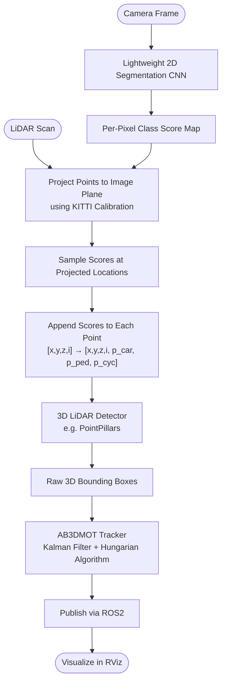
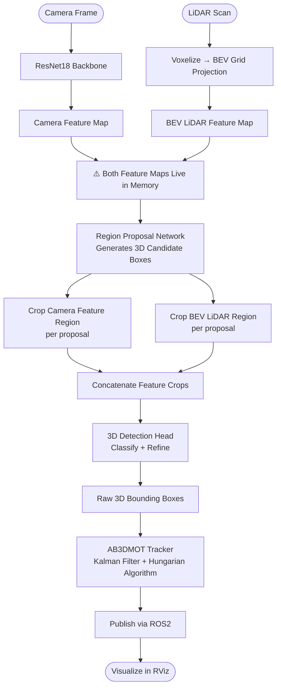

# Multi-Sensor Fusion Pipeline — Architecture Proposal

**Project:** AI-Based Data Fusion
**Date:** 2026-03-30

---

## The Goal

Fuse **Camera + LiDAR** (KITTI Dataset) to detect and track 3D objects in real time, visualized in RViz over ROS2.

**Hard constraint:** Must run entirely on a standard laptop — limited VRAM, limited compute. No cloud, no GPU cluster.

---

## Two Approaches Evaluated

| | Pipeline A — PointPainting | Pipeline B — AVOD |
|---|---|---|
| **Flow** | Sequential | Parallel (dual-stream) |
| **Memory** | One stream at a time | Two feature maps live simultaneously |
| **OOM Risk** | Very Low | Moderate to High |
| **Complexity** | Low | High |
| **Verdict** | Recommended | Not recommended for laptop hardware |

---

## Pipeline A — PointPainting

> **Core idea:** Use 2D image semantics to enrich the LiDAR point cloud, then detect in 3D.

**Steps:**

1. Run a lightweight CNN on the camera image → get a per-pixel class score map
2. Project each 3D LiDAR point onto the 2D image plane (using KITTI calibration matrices)
3. Append the image scores to each point: `[x, y, z, i]` → `[x, y, z, i, p_car, p_ped, p_cyc]`
4. Feed the enriched point cloud into a standard 3D detector (e.g. PointPillars)

**Why it's memory-safe:** The image score map is sampled and discarded — it never coexists with the 3D detector's tensors. Linear, single-stream memory footprint.

---

### PointPainting — Activity Diagram

---

## Pipeline B — AVOD

> **Core idea:** Extract feature maps from both sensors in parallel, propose regions, fuse the crops.

**Steps:**

1. **Camera stream:** Pass image through ResNet18 → 2D camera feature map
2. **LiDAR stream:** Voxelize point cloud → project to Bird's-Eye-View grid → BEV feature map
3. Both maps are held in memory at the same time
4. A Region Proposal Network (RPN) generates 3D candidate boxes
5. Per proposal: crop from camera map + crop from BEV map → concatenate
6. Final detection head classifies and refines each proposal

**Note:** ResNet18 is chosen over ResNet34 to reduce backbone memory — but both feature maps still coexist during RPN and crop-fusion, which is the real bottleneck.

---

### AVOD — Activity Diagram

---

## Shared Post-Detection Steps

Both pipelines use the same downstream chain:

- **AB3DMOT** — 3D multi-object tracker using a Kalman Filter (state prediction) and the Hungarian Algorithm (frame-to-frame association). Produces persistent track IDs.
- **ROS2 Publisher** — Tracked objects serialized as `visualization_msgs/MarkerArray` and published on a ROS2 topic.
- **RViz** — Renders 3D bounding boxes with track IDs overlaid on the live point cloud.

---

## Tradeoff Analysis

| Criterion | PointPainting | AVOD |
|---|---|---|
| **Fusion Stage** | Pre-detection (point enrichment) | Mid-detection (region-level crop) |
| **Data Flow** | Sequential — one stage at a time | Parallel — two streams running together |
| **Memory Usage** | Low — single stream, score map discarded after sampling | High — two full feature maps live simultaneously |
| **OOM Risk on Laptop** | Very Low | Moderate to High |
| **Camera Backbone** | Lightweight segmentation CNN | ResNet18 (downgraded from ResNet34 to save memory) |
| **LiDAR Representation** | Raw enriched point cloud | Voxelized BEV grid projection |
| **Implementation Complexity** | Low — each stage is independent | High — RPN + dual-crop synchronization |
| **Debuggability** | High — inspect output at every stage | Medium — bugs harder to isolate across parallel streams |
| **Team Parallelism** | High — stages can be owned independently | Medium — streams are tightly coupled |
| **Detection Accuracy** | Good — semantic enrichment improves LiDAR-only baseline | Higher — region-level cross-modal fusion |
| **Latency** | Low | Higher — parallel extraction + RPN overhead |
| **Fit for Laptop Hardware** | Excellent | Poor |

---

## Recommendation — Use PointPainting

**Three reasons:**

**1. Memory safety.** PointPainting never holds two large tensors simultaneously. AVOD does — and on a laptop inside Docker, that is a real OOM risk that crashes the node with no graceful recovery.

**2. Lower complexity.** Each stage of PointPainting is independent and testable in isolation. AVOD requires both streams to be working before the RPN can even be evaluated — harder to debug, harder to divide across team members.

**3. Good enough accuracy.** Painting semantic scores onto LiDAR points gives meaningful gains over LiDAR-only detection (Vora et al., 2020), especially for pedestrians and cyclists. For a KITTI single-camera setup, this is the right trade-off.

---

> **Decision: Proceed with PointPainting.**
> It is lightweight, sequential, modular, and built for constrained hardware. It meets every project requirement without the memory risk or implementation overhead of AVOD.
